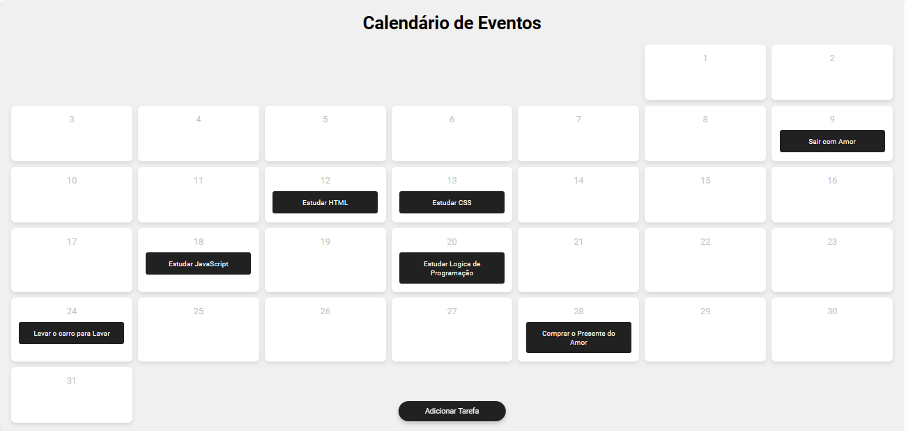

<h1 align="center">
  Calendário de Eventos
</h1>

  

## 💻 Projeto

Este projeto tem caráter comu-educacional e tem como objetivo principal o aprimoramento das minhas habilidades em HTML e CSS. 

Testar Site: [AQUI](https://nickdev-calendario.netlify.app/)

## 🚀 Tecnologias

- HTML
- CSS
- JS

## 📔 Conhecimentos abordados

- [X] Uso semântico do HTML
- [X] Responsivo